# QRZero

A fast, reliable amateur radio logger for Windows, macOS (Apple Silicon) and Linux.

QRZero keeps your log in one SQLite file, stays quick with hundreds of thousands of QSOs, and talks to the programs and radios in a ham shack: WSJT-X, JTDX, N1MM Logger+, Hamlib, TCI, serial CAT, rotators, the DX cluster, QRZ.com, LoTW, Club Log and eQSL. It is built with DX chasing and CW in mind: spots that would be new for you raise an alert, awards from DXCC to the CW club awards are tracked as you log, and QSL cards, labels and online uploads are handled in one window.

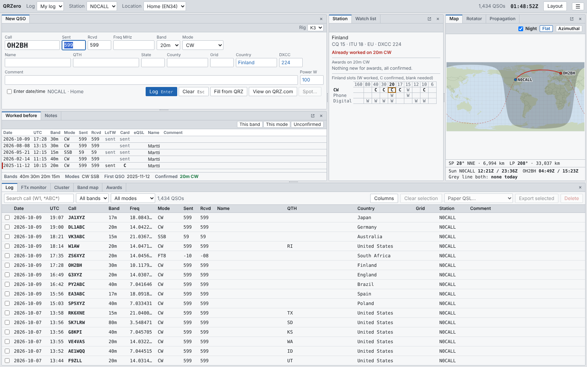

*Every screenshot in this file uses a made-up demo log for the placeholder call N0CALL. The country list, spots, contest calendar, decodes and confirmations are sample data.*

**Contents:** [Install](#install) · [First run](#first-run) · [Logging](#logging-qsos) · [Radios and rotator](#radios-and-rotator) · [WSJT-X, JTDX and N1MM](#wsjt-x-jtdx-and-n1mm) · [DX cluster and band map](#dx-cluster-band-map-and-watch-list) · [Awards](#awards) · [QSL and online services](#qsl-and-online-services) · [ADIF](#adif-import-and-export) · [UDP connections](#udp-connections-and-startup-programs) · [Layout](#arranging-the-window) · [Settings, shortcuts and backups](#settings-keyboard-shortcuts-and-backups) · [Browser mode](#using-a-browser) · [Build from source](#building-from-source) · [Status](#status)

## Why QRZero

- **Speed.** The log grid only loads the rows on screen, searches are indexed, and the interactive queries are checked against a 200,000-QSO log in the test suite. The design goal was a logger that never makes you wait mid-QSO.
- **Every mode is equal.** CW, phone and digital get the same treatment everywhere: entry defaults, awards, band map, spot colours.
- **Nothing is lost.** Every ADIF field of every QSO is stored, including fields other programs add for themselves, and comes back out on a full export. The log is one file with daily automatic backups.
- **Made for DX chasers and CW operators.** A **Needed now** list with sound and popup alerts, split-aware spots, club numbers on CW QSOs, SKCC, CWops, NAQCC and FISTS awards with CWT medals, and bulk paper-QSL mailings with label printing. Every mode is still treated equally.
- **Plain and classic.** A dense desktop-logger layout with panes you can move, tab, resize and pop out to a second screen. No wizard to fight, no cloud account.
- **Local first.** Your log lives on your computer. QRZero only talks to the internet for the services you switch on. Passwords go in Windows Credential Manager (the macOS Keychain, or the Linux desktop keyring), never in the log file.

## Install

Download the files for the newest version from the [Releases page](https://github.com/nreed97/QRZero/releases).

| Platform | File | Notes |
| --- | --- | --- |
| Windows | `QRZero_<version>_x64-setup.exe` | Normal installer. |
| Windows | `QRZero_<version>_x64_en-US.msi` | The same app as an MSI, for managed installs. |
| Windows | `QRZero_<version>_portable.exe` | Nothing to install: copy it anywhere and run it. Needs the WebView2 runtime that ships with Windows 10 and 11. |
| macOS (Apple Silicon) | `QRZero_<version>_aarch64.dmg` | Open it and drag QRZero to Applications. The app is unsigned, so the first launch needs Control-click → **Open** (or **System Settings → Privacy & Security → Open Anyway**, or `xattr -dr com.apple.quarantine /Applications/QRZero.app`). macOS 11 or later, M1 or newer. |
| Linux | `.deb`, `.rpm` or `.AppImage` | Debian/Ubuntu, Fedora/openSUSE, or any distribution. Make the AppImage executable and run it. |
| Linux, headless | `QRZero-server_<version>_linux-x86_64.tar.gz` | The server without a window, for a shack PC or Raspberry Pi-class machine you reach from a browser. See [Using a browser](#using-a-browser). |

Windows is the main platform and gets the most testing. Your log is stored in `%APPDATA%\QRZero\qrzero.db` on Windows, `~/Library/Application Support/QRZero/qrzero.db` on a Mac and `~/.local/share/QRZero/qrzero.db` on Linux.

QRZero checks GitHub once a day for a newer release and shows a link in the top bar when there is one. Nothing is downloaded or installed for you, and the check can be switched off in **Settings → General**.

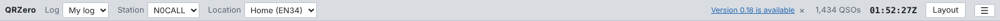

## First run

The first time QRZero starts, a setup wizard walks you through the basics. Every step except the callsign can be skipped, and you can run it again from **Settings → General**; it never removes anything.

| | |
| --- | --- |
| 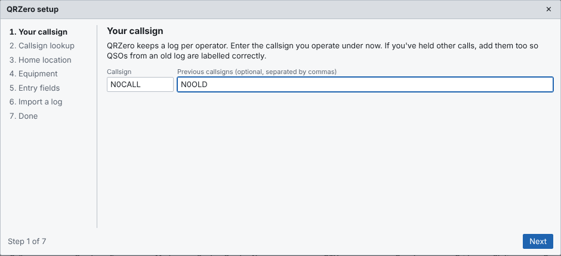 | 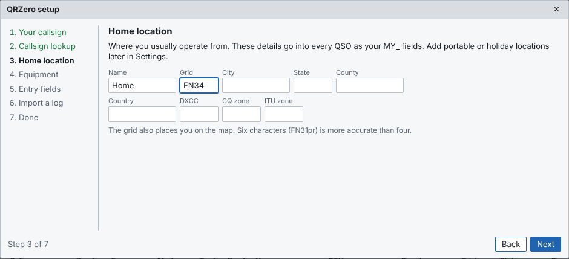 |
| 1. Your callsign, plus any calls you held before, so old QSOs are labelled correctly. 2. Your QRZ.com login if you have an XML subscription. | 3. Your home location: name, grid, city, state, zones. |
| 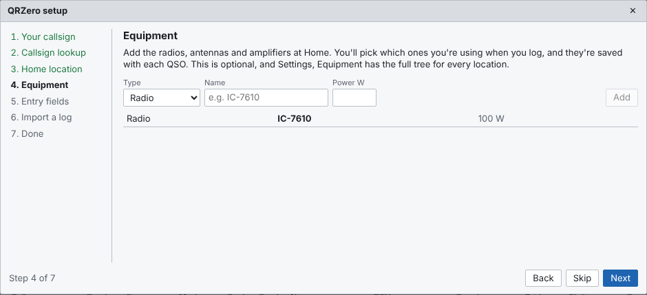 | 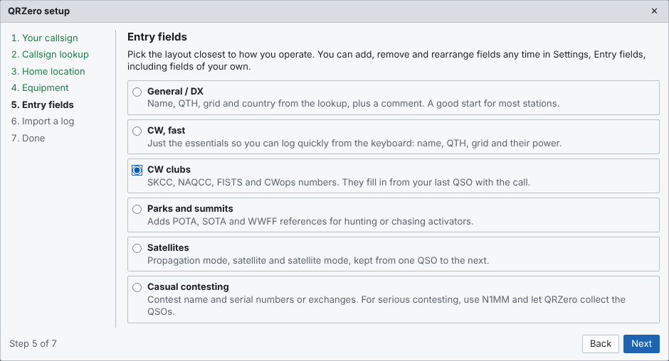 |
| 4. Your radios, antennas and amplifiers. | 5. A starting layout for the entry form: general/DX, CW, CW clubs, parks and summits, satellites or casual contesting. 6. Import an ADIF log. |

### Coming from another logger

1. In your old logger, export your whole log as ADIF.
2. In QRZero, choose **Import ADIF…** from the ☰ menu (or use the wizard's import step), pick the file and the location those QSOs were made from.
3. Leave **Skip duplicates** on, so importing the same file twice is safe.

Fields the other program added for itself (`APP_…`) are kept, and come back out if you export with **Full** fields. QRZero can also pass QSOs on to other programs over UDP while you run both side by side (see [UDP connections](#udp-connections-and-startup-programs)).

## Logging QSOs

Type the call, press <kbd>Tab</kbd> or <kbd>Space</kbd>, and QRZero looks it up and fills in name, QTH, state, county, grid, country and DXCC. Press <kbd>Enter</kbd> to log. The start time is taken from the moment you begin typing; the form clears and the cursor goes back to the call. Boxes filled by a lookup are coloured differently from what you typed, and what you type always wins.

- **Lookups** use QRZ.com XML when you have a login (results are cached for 30 days) or fall back to your own earlier QSOs and the country file. **Fill from QRZ** and **View on QRZ.com** buttons sit next to Clear.
- **Frequency, band and mode** follow each other: type a frequency and the band is set; pick a mode and the usual report is filled in (all of those defaults are yours to change). FT4 is stored the way ADIF wants it, as `MFSK`/`FT4`, and shown as FT4.
- **Entry fields** are yours: pick a starting layout and add, remove, rename, resize or give defaults to any ADIF field, or invent your own. Tick *keep* to hold a value from one QSO to the next. CW, Phone and Digital can each have a layout of their own, so CW can show club numbers while SSB shows something else.

  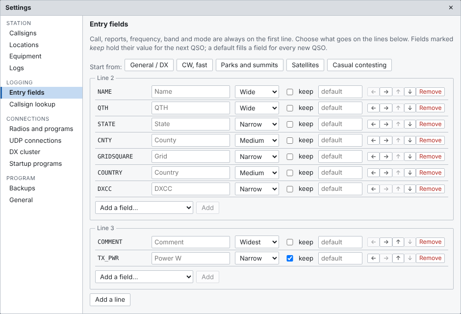
- **CW club numbers.** The **CW clubs** layout adds **SKCC**, **NAQCC**, **FISTS** and **CWops** boxes to the entry panel. They fill in from your last QSO with the call (in the lookup colour, so you can type over a new suffix or number) and feed the club awards described under [Awards](#cw-club-awards).

  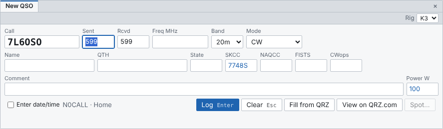
- **Enter time** lets you log from a paper log after the fact.
- **Rig, antenna and amplifier** are chosen per location. Give each antenna its bands and the **Ant** box can pick the right one for the band automatically. Each QSO records `MY_RIG`, `MY_ANTENNA` and power.
- **Spot a station you worked.** The **Spot…** button in the entry panel, or **Spot … to the cluster…** in the log's right-click menu, shows the exact line that will go to the cluster, with the frequency and a comment you can edit, and sends nothing until you click **Send spot**. Only QSOs from the last 10 minutes can be spotted (changeable in **Settings → DX cluster**), so an old contact is never spotted by mistake. A QSO logged in split is spotted on the frequency you listened on.

  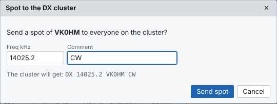
- **Locations, callsigns and logs.** Several logs, several station callsigns per log, and any number of operating locations (home, a holiday QTH, a park) whose details go into each QSO as the ADIF `MY_…` fields.

### Worked before, the Station pane and notes

As soon as you type a call, the side panes tell you what you need to know.

| | |
| --- | --- |
| 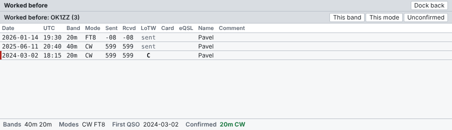 | 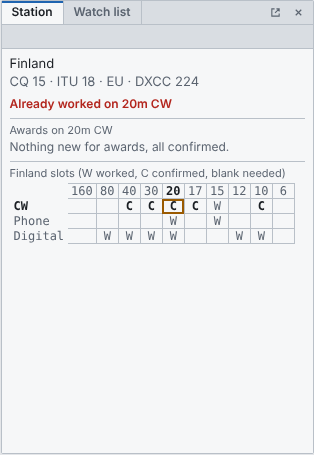 |
| **Worked before** lists every earlier QSO with the station (portable forms such as `/P` included) with QSL status, a duplicate marker, and quick filters for this band, this mode and unconfirmed. | The **Station** pane shows the station's details, your note, duplicate warnings, what the QSO would be worth for each award, and a band-by-mode grid of the entity's DXCC slots (**W** worked, **C** confirmed, blank still needed). |

A call that would be new for you says so plainly:

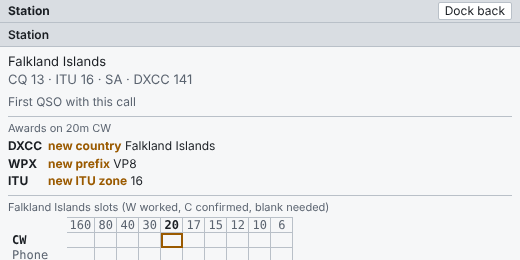

**Station notes** are free text kept per callsign in the **Notes** pane ("QSL via bureau only", "promised a sked on 40m"). They come back every time you type that call and are listed and searchable when the call box is empty.

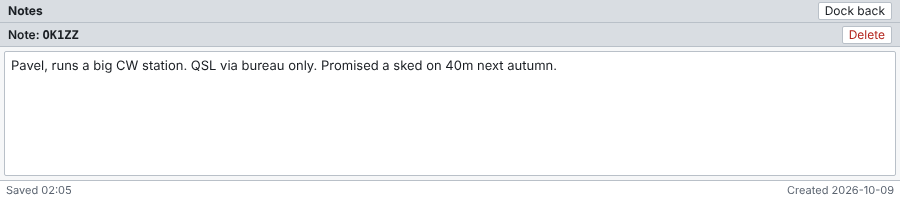

### The map

The **Map** shows your location, the other station and the short path (solid) and long path (dashed), with beam headings and distances in kilometres or miles. **Flat** is a world map; **Azimuthal** is centred on you so straight lines are true beam headings. The night shading shows the grey line, and the line under the map gives sunrise and sunset at both ends and the times today when the grey line covers both. With a rotator connected, a line shows where the beam points and **Turn SP** / **LP** buttons turn it.

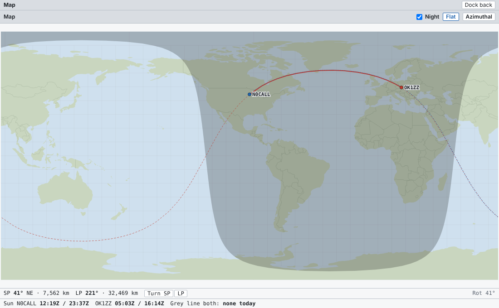

### The log grid and QSO editor

The log grid stays fast at any size. Search by call (with `*` wildcards), narrow by band and mode, select with click, <kbd>Ctrl</kbd> and <kbd>Shift</kbd>, and choose, reorder and resize columns.

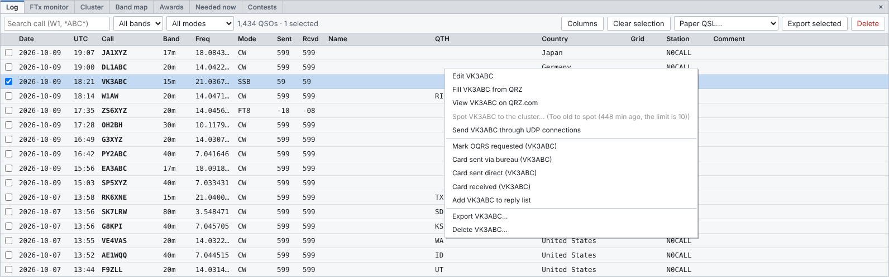

The right-click menu acts on the selected rows: edit, fill from QRZ, view on QRZ.com, spot to the cluster, send through your UDP connections, mark OQRS and card status, add to the reply list, export and delete. Double-click a QSO to edit it in its own window, grouped as Contact, Their location, My station, QSL (a table for LoTW, card, eQSL, QRZ and Club Log) and Other fields. **All ADIF fields** at the bottom edits everything stored with the QSO.

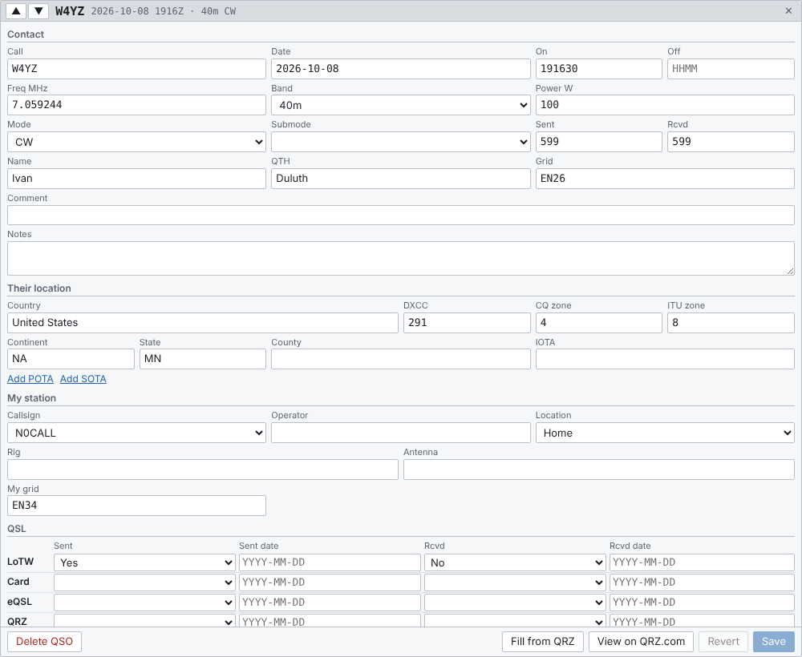

## Radios and rotator

QRZero reads frequency, mode, split and PTT from your radios and can tune them. Each radio is equipment at a location, with its own **Rig control** method:

| Rig control | For |
| --- | --- |
| Hamlib `rigctld` | Almost any radio Hamlib supports. |
| TCI | ExpertSDR, SunSDR, Thetis, and Flex radios through a TCI bridge. Every receiver or slice shows up as its own radio. |
| Kenwood / Elecraft / Flex CAT | Serial or SmartSDR CAT ports. |
| Yaesu CAT | FT-991A, FTDX10, FTDX101, FT-710 and other recent Yaesu radios. |
| Icom CI-V | Icom radios over USB or a CI-V interface (IC-7300, IC-7610, IC-705 and others). |

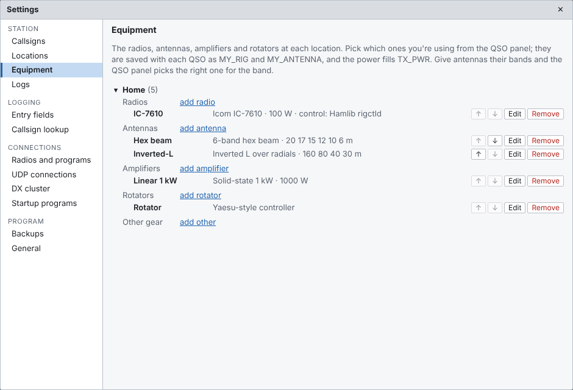

- **Follow a radio.** Pick it in the QSO panel and the frequency, band and mode follow your tuning. Typing a frequency or changing the mode tunes the radio, and clicking a decode, spot or DXpedition tunes it too.
- **Split.** When a radio is in split, the header shows RX and TX frequencies, the entry form has **TX MHz** and **RX MHz** boxes, and both are logged. Clicking a cluster or band map spot whose comment says `UP 5`, `DN 2` or `QSX 14.205` tunes the radio and sets split to match.
- **Several radios (SO2R, Flex slices).** A small button next to the VFO readout lists every radio; <kbd>Alt</kbd>+<kbd>1</kbd>, <kbd>Alt</kbd>+<kbd>2</kbd> and <kbd>`</kbd> switch between them. The readout turns red while a radio transmits.
- **Rotators.** QRZero talks to a rotator directly over Hamlib `rotctld` (TCP), Yaesu GS-232 (serial or TCP, which covers controllers such as the WRC) or through PstRotatorAz (UDP). It can also take bearings from N1MM and pass them to the rotator you set up.

The **Rotator** pane is a compass dial: click it to turn, use the **Short path** and **Long path** buttons for the station in the entry form, type a bearing, or use your own presets (EU, JA and so on). Tick **Map** to put an azimuthal map behind the dial.

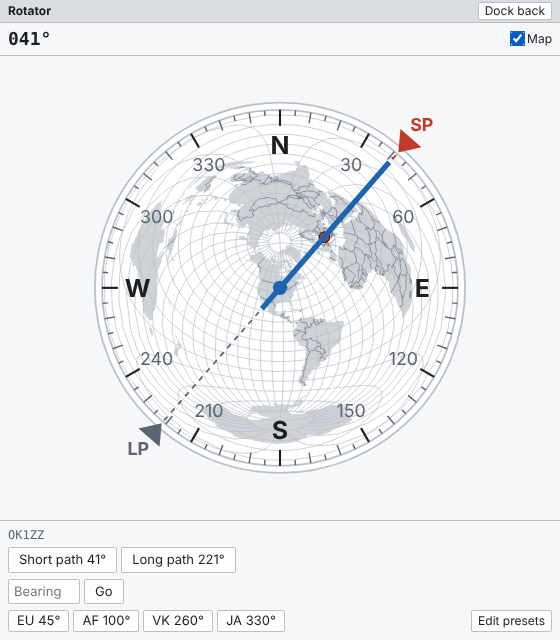

## WSJT-X, JTDX and N1MM

QRZero listens to WSJT-X and JTDX (any number of copies, each on its own port or sharing a multicast group) and to N1MM Logger+ over UDP.

- QSOs logged in WSJT-X, JTDX or N1MM are added to your log at the selected location (edits and deletes in N1MM follow), and QRZero fills in what they left blank from QRZ: name, QTH, state, county, grid. What the program sent is never overwritten.
- Other programs that also want WSJT-X's stream, such as GridTracker or JTAlert, can be fed with **Pass on to**, a relay connection, or a multicast group.
- N1MM's radio information can be followed by the QSO panel, and N1MM can turn your rotator through QRZero.

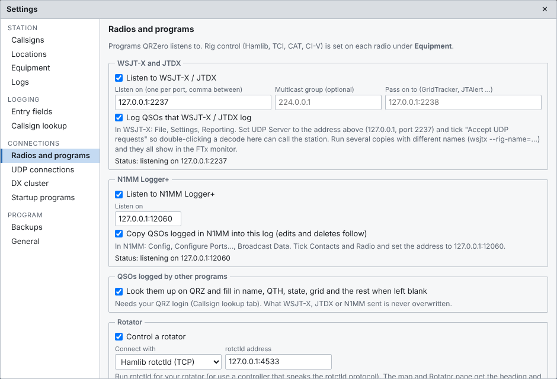

### The FTx monitor

The **FTx monitor** collects the decodes from every running WSJT-X and JTDX in one list and flags each one against your log: **New DXCC**, **New band**, **New mode**, **New grid** (6 m and up), **New call**, **New on band** and **Worked**. Stations calling you and stations on your watch list stand out.

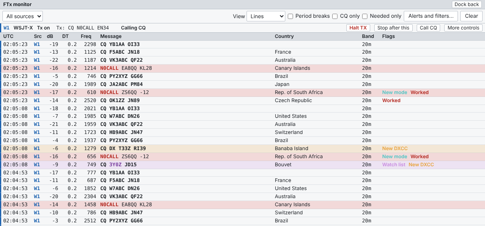

- **Click** a decode to fill in the QSO panel and look the call up. It never retunes a radio. **Double-click** to have WSJT-X call the station.
- Every decode carries a tag and colour for the program, slice or radio it came from, so two copies on two slices or bands stay apart.
- A one-line control strip for each WSJT-X or JTDX shows whether it is transmitting, what it is sending, and where the QSO has got to, with **Halt TX**, **Stop after this**, **Call CQ** and a **More controls** line (free text, DX call, Rx offset, FT8/FT4, configuration switch, replay, clear).
- **Call boxes** view shows each station heard as a box, a row per period, much like JTAlert's callsign list, coloured by its most important alert.
- **Alerts and filters** lets you pick which alerts are on and their colours, hide worked stations, set a weakest signal, limit continents and ignore calls.

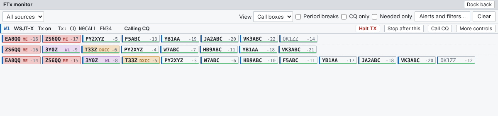

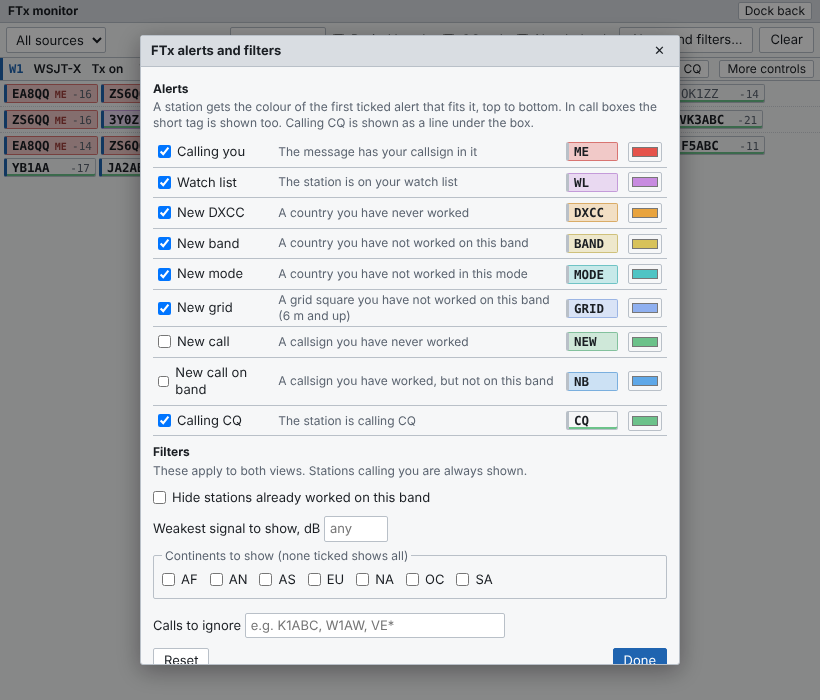

## DX cluster, band map and watch list

### Cluster

Add nodes under **Settings → DX cluster**; QRZero connects to the first and moves down the list if a node drops. Spots are flagged against your log the same way as FTx decodes, coloured by mode (blue CW, green digital, orange phone), and a new spot of the same station replaces the old one. Filter by band, mode group, age, **Needed only** and **Hide worked**, and use **Origin and country…** to hide spots you could never work (spotter on another continent, same-country spots, your own country). Click a spot to fill in the entry form and tune the radio. A **Console** lets you type commands to the node. To tell the cluster you worked someone, see [Spot a station you worked](#logging-qsos).

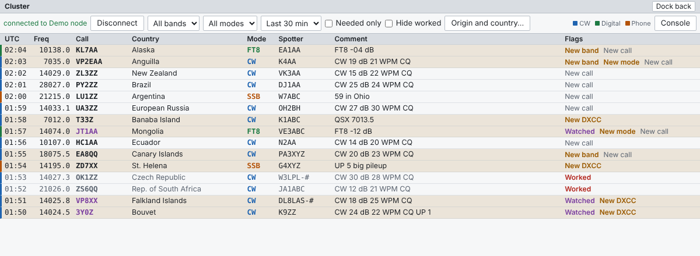

### Needed now

The **Needed now** pane lists only the spots on the air that would be new for your log, best first: a **new entity**, then a **new band** for an entity you have worked, then a **new mode**. It uses the same flags as the Cluster pane, lists each call, band and mode once however many people spot it, ranks CW, phone and digital together and drops spots after the time you choose (30 minutes to start with). Click a spot to fill in the QSO panel and tune the radio.

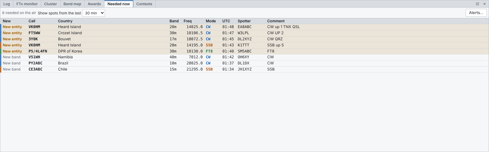

**Alerts.** When a needed station is spotted QRZero can play a sound (a double beep for a new entity, a single one for a new band or mode) and show a popup in the corner of the window; click the popup to tune to the station. Sound and popup are switched on separately, you choose how much alerts (new entities only, entities and bands, or modes too), and a call is not alerted again on the same band and mode for a while. Spots the cluster sends when you first connect are not alerted. The settings are under **Settings → DX cluster**, or press **Alerts…** in the pane.

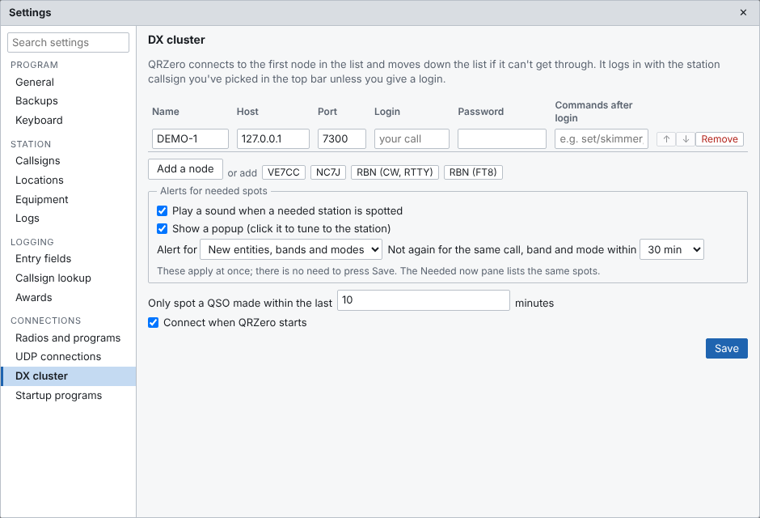

### Band map

The **Band map** shows one band as a frequency scale with cluster spots and your FT8/FT4 decodes beside it, follows the radio, zooms, and shows a US or IARU Region 1 band plan strip. Spots never overlap; click one to fill in the form and tune.

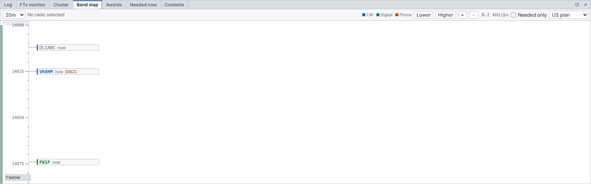

### Watch list

Tell QRZero which stations you are chasing (a call, a prefix such as `VP8`, or a whole DXCC entity), optionally limited to bands and modes, with a note. When one turns up on the cluster or in your decodes you get a notice in the top bar, a line in **Recent hits**, and a **Watched** mark in the Cluster and FTx panes. It works with the pane closed.

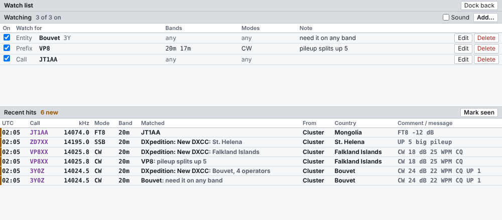

### DXpeditions

The **DXpeditions** pane reads NG3K's calendar and lists what is on the air now or starting soon, marking what would be new for you (a new DXCC, or the bands and modes you still need for an entity you have worked). A cluster spot of a needed one raises the same alert as the watch list, and clicking a row tunes to its last spot. You can add your own entries for ones the calendar lacks.

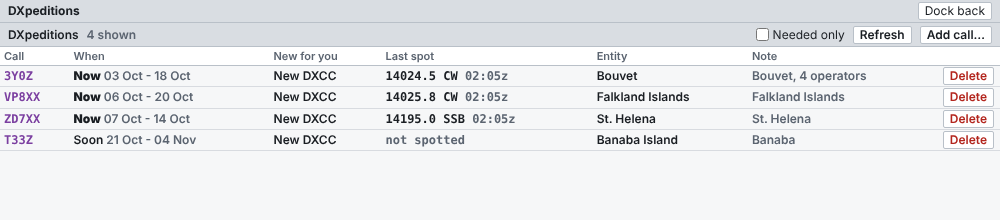

### Contests

The **Contests** pane reads the WA7BNM Contest Calendar and lists the contests on the air now and those coming up, with a CW / Phone / Digital filter and a link to each one's rules. It is a calendar only; contest logging stays in your contest logger (QSOs from N1MM Logger+ come into QRZero over UDP). The last list is kept in the log file, so it is still there offline.

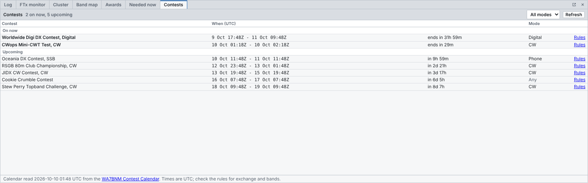

### Propagation

The **Propagation** pane shows solar flux, sunspots, A and K index, X-ray, solar wind, Bz, MUF and N0NBH's band-condition estimates for HF and VHF, with sunrise and sunset at your end and the other station's. It only fetches the feed while the pane is open.

Once you type a call or pick an entity, the pane ends with a **Band forecast**: bands from 160 m to 10 m against the 24 hours of today in UTC, green where the band is likely open between you and the other station and amber where it is marginal, with the current hour outlined. It is a rough estimate worked out on your own computer from the solar flux, the K index, the sun's height along the path and the date, with nothing extra to download. It is a guide to when to look, not a replacement for a prediction program, and it does not know about sporadic E.

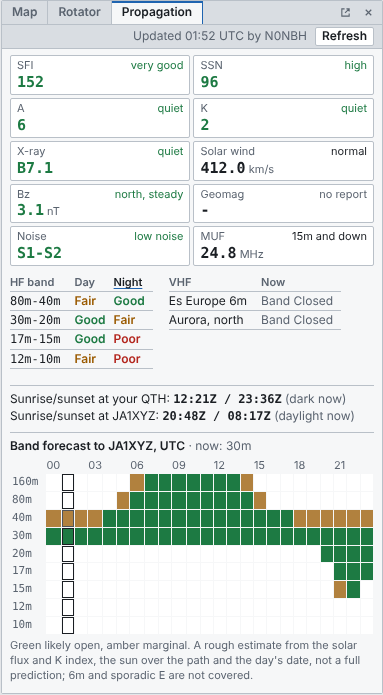

## Awards

The **Awards** pane tracks **DXCC**, **WAS**, **WAZ**, **WPX**, **WAC**, **ITU zones**, **VUCC** (grids on 6 m and up), **IOTA** and **US counties**, with the **DXCC Challenge** and **5BDXCC** totals, plus the CW club awards below. Each row shows Mixed, CW, Phone and Digital plus every band from 160 m to 70 cm, a green **C** for confirmed and an amber **W** for worked. You choose what counts as confirmed (LoTW, cards, eQSL), can limit it to one callsign, hide what is already confirmed, and click a row to see its QSOs in the log. The QSO panel shows what the call you are typing would be worth for each award, and a download of confirmations lists what it newly confirmed (see [QSL and online services](#qsl-and-online-services)).

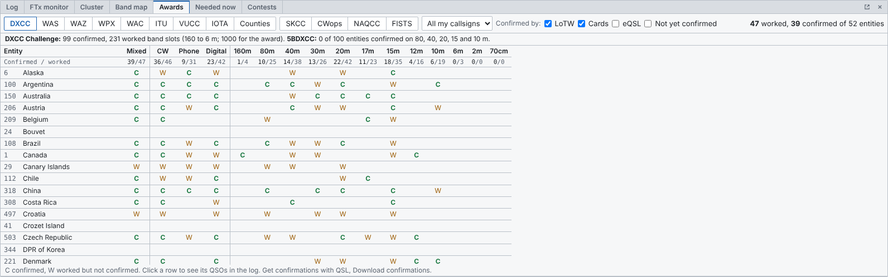

Awards you don't chase can be switched off in **Settings → Awards**. They disappear from the pane and from the award lines in the QSO panel, your log is untouched, and ticking one again brings it back as it was. Any award added in a later version starts switched on.

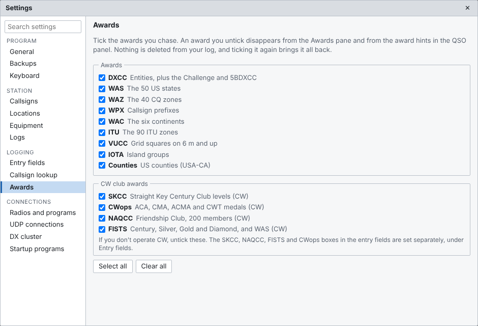

### CW club awards

The **SKCC**, **CWops**, **NAQCC** and **FISTS** buttons count from the club numbers logged on CW QSOs (see [CW club numbers](#logging-qsos)). Members are counted by number, not call, and confirmations don't apply: the clubs work from your log. QRZero has no member lists, so it cannot check that a number is real or that the member was active when you worked them; check the club's own rules before you apply.

- **SKCC**: Centurion (100 members, with every further 100 a new level), Tribune (50 Centurions, Tribunes or Senators from the suffix you logged) and Senator (200 Tribunes or Senators), with the date each was first reached and the members per band for the single-band endorsements.
- **CWops**: ACA and ACMA per year, CMA per band, DXCC and US states worked with members, and the **CWT medals**: one point per hourly CWops test in which you made 10 or more contacts (the same call counts again on another band), with bronze, silver and gold at 50, 80 and 120 points a year (lower thresholds if you operate outside North America and Europe). Every CWT hour of the year is listed with its QSOs and contacts, so near misses show, and points for tests worked outside this log can be added by hand per year.
- **NAQCC**: the Friendship Club (200 different members, then every further 200).
- **FISTS**: Century, Silver, Gold and Diamond Century (100, 250, 500 and 1000 points, one for a member in your own country and two for another DXCC entity) and WAS.

| | |
| --- | --- |
| 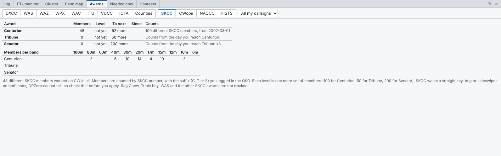 | 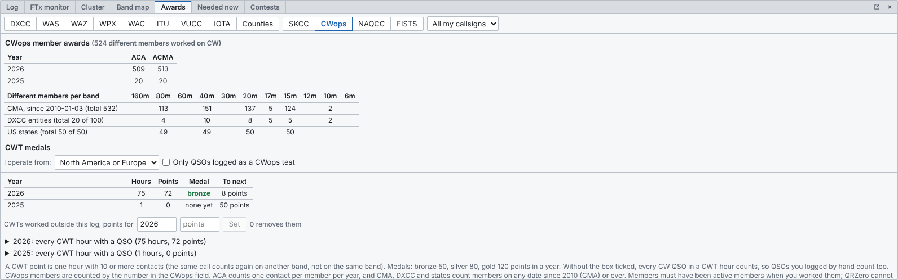 |
| 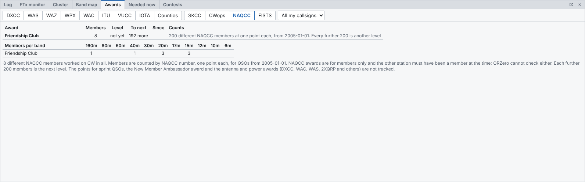 | 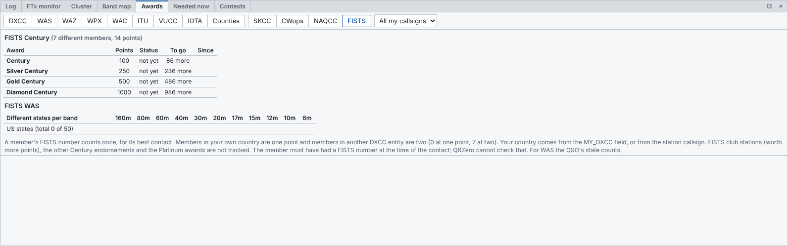 |

## QSL and online services

Choose **QSL: LoTW, QRZ, Club Log…** or **QSL lookup…** (<kbd>Alt</kbd>+<kbd>Q</kbd>) from the ☰ menu. One QSL window has four tabs: **Look up**, **Cards to send**, **To reply to** and **Online services**. Each QSO keeps its status in the standard ADIF fields (sent, date, confirmed), so other loggers see what has been sent, and each service has a **QSOs from** date so an imported log is not uploaded twice.

### Online services

There is one page per service, with its own login or API key and its own upload settings. Passwords and keys go in Windows Credential Manager (the Keychain on a Mac, the desktop keyring on Linux), never in the log file.

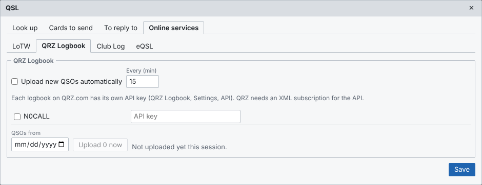

- **LoTW.** Signs and uploads through your installed TQSL when you click the button, either everything waiting or a date range (for example when moving from another logger), and downloads confirmations, filling in the other station's state, zones, grid and county where yours are blank. Tick **Download confirmations automatically** and set how often (once a day to start with) to have confirmations fetched in the background.
- **QRZ Logbook, Club Log and eQSL.** Each has its own **Upload new QSOs automatically** tick and **Every (min)** interval (15 minutes to start with), so one service can upload every 5 minutes while another waits an hour or is off. Uploads are per callsign, and edited QSOs are sent again. eQSL confirmations can be downloaded on demand or once a day.
- **New confirmations.** After a LoTW or eQSL download, a **New toward your awards** list shows what the confirmations counted for the first time: a new entity, state, zone or prefix, and the new bands and modes it filled. It follows your award settings and the confirmation sources you tick in the Awards pane.

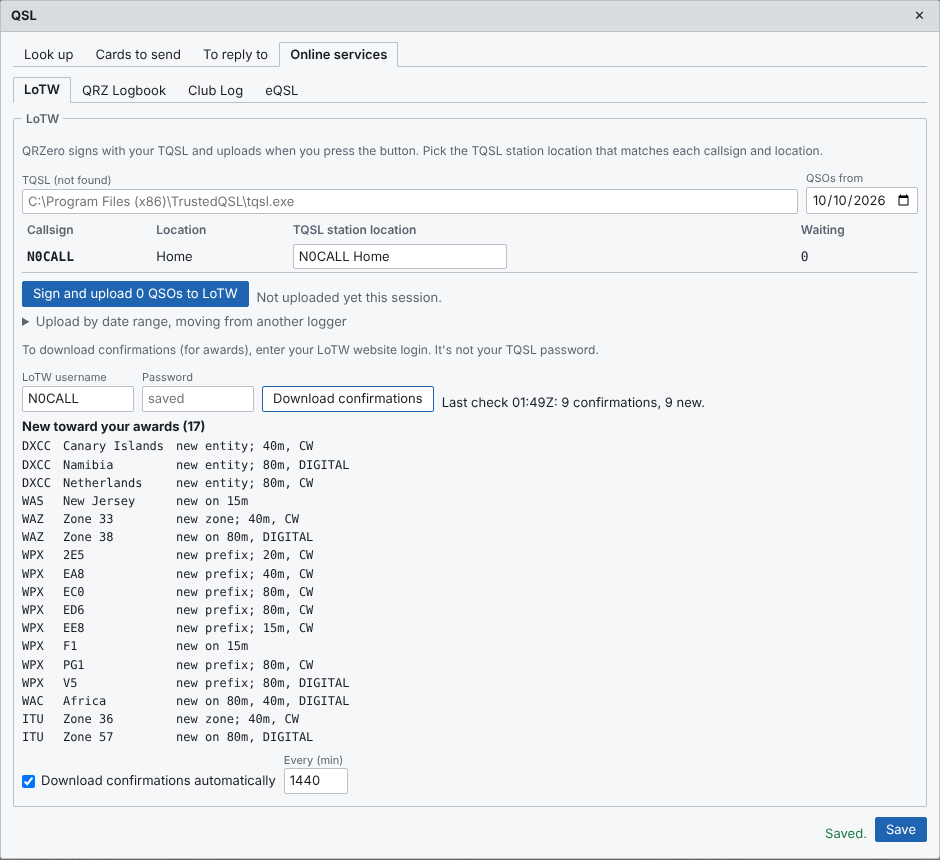

Moving from another logger? Download confirmations first: everything the service already has is marked sent and confirmed, so the first upload does not send duplicates.

### Confirmation status

The QSO editor shows LoTW, card, eQSL, QRZ and Club Log together with a one-line summary, and the log has **LoTW R**, **QSL R**, **QRZ R**, **OQRS** and **Confirmed** columns (and sent-status columns for each service). Your Club Log OQRS requests are tracked as a reminder.

### Look up, Cards to send and To reply to

- **Look up** is for answering cards in bulk: type a call, press Enter, and see that station's QSOs newest first with the card status, plus a contact card (name, address, QSL manager, email, grid, zones and how many cards you have sent). Tick the QSOs for the card and mark them queued, sent or received, by bureau or direct. The call is matched whole, so DL1ABC finds DL1ABC/P but not DL1ABCD.
- **Cards to send** lists everything queued. Print Avery 5160/L7160 or 5163/L7163 address labels (several QSOs with one station share a label) or Brother QL-700 labels for the confirmation block on the back of a card. The default is a 50 mm by 4 inch DK-22223 label that reads "CONFIRMING QSO WITH", the call in large type, then date, UTC, MHz, mode and RST for up to four QSOs, newest first, with an optional bottom line for your power or rig; DK-1201, DK-1209 and DK-1202 rolls are there too. **Group by** sorts the queue into piles for a bulk mailing, one per country for your outgoing bureau (cards for a QSL manager get a pile per manager) or one per manager, each with its card and station count. Labels print pile by pile.
- **To reply to** is the list of cards that arrived and still need an answer. Add a call from the log's right-click menu or the Look up tab, keep a note (direct, via bureau, an address), and click **Replied**, which can also mark the QSOs as card sent by bureau or direct.

| | |
| --- | --- |
| 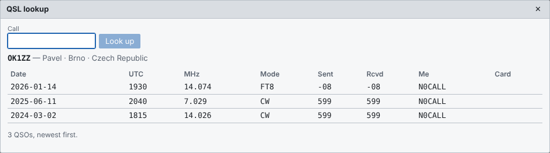 | 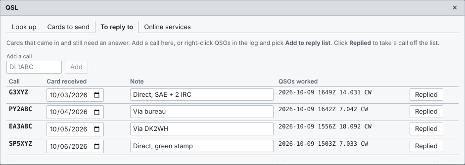 |

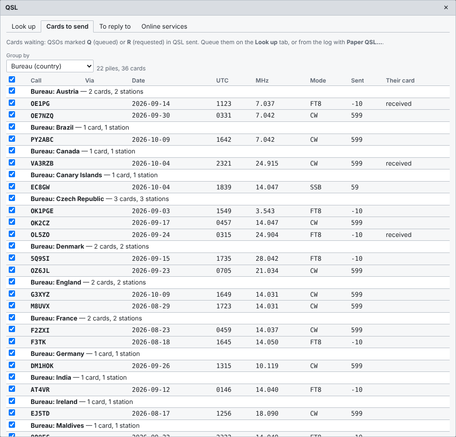

## ADIF import and export

QRZero reads and writes ADIF `.adi` files, including older Windows-1252 files with accents.

- **Import** links the QSOs to one of your locations, can fill in or replace the location's `MY_…` fields, skips duplicates (same call, band and mode within a minute) and can add unknown station callsigns to your list. Every field in the file is kept.
- **Export** the selected QSOs, what the grid shows now, or anything matching filters (date range, bands, modes, callsigns, locations, even one ADIF field value). **Standard** writes the fields other loggers and QSL services use; **Full** writes everything stored, for backups or a move to another QRZero install.

| | |
| --- | --- |
| 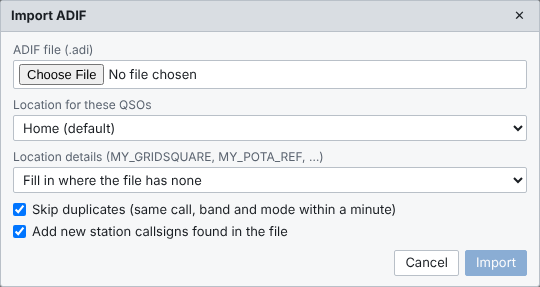 | 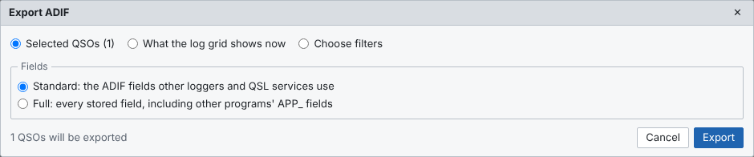 |

## UDP connections and startup programs

For everything QRZero does not know by name (an antenna switch, a band decoder, another rotator program, a script of your own), **Settings → UDP connections** sends a message when something happens,:

- **When:** a QSO is logged, a radio changes frequency or mode, a rotator turn is requested, a call is entered, or a WSJT-X/JTDX or N1MM packet arrives (to relay it untouched).
- **Format:** N1MM RadioInfo XML, N1MM contactinfo XML, ADIF record, JSON, PstRotatorAz azimuth, or your own text with `{CALL}`, `{FREQ_HZ}`, `{BAND}`, `{MODE}`, `{AZ}` and other placeholders (any ADIF field for a logged QSO).
- **Send test** shows exactly what would go out.

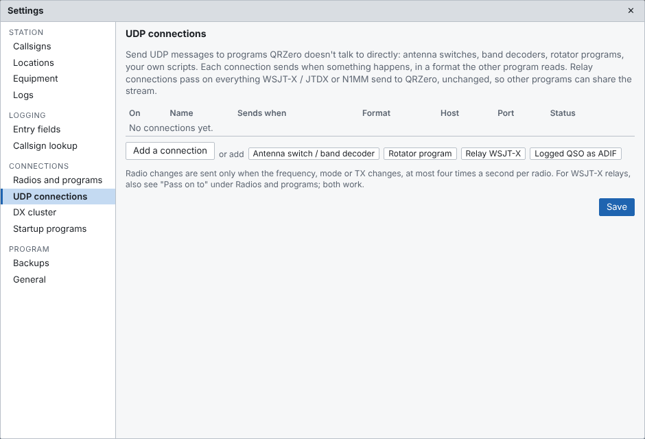

**Startup programs** lists the programs you always run with QRZero (PstRotatorAz, a rigctld, a band decoder) and starts them in the background when QRZero starts, skipping any that already run.

## Arranging the window

Everything is a pane: New QSO, Station, Worked before, Map, Log, FTx monitor, Cluster, Needed now, Awards, Band map, Watch list, DXpeditions, Contests, Propagation, Rotator and Notes. Some start as tabs behind others (Needed now beside Cluster, Contests beside DXpeditions); open or hide any of them from the **Layout** menu. Drag a tab to dock a pane beside another or stack it as a tab, drag the bars to resize, hide panes you don't use, and pop any pane except New QSO and the Log out to its own window for a second screen. Save arrangements by name (a laptop layout, a two-screen shack layout, an FT8 evening) and switch between them; **Lock panes** stops accidents. Layouts live in the log database, so they survive restarts and come back with a restored backup.

| | |
| --- | --- |
| 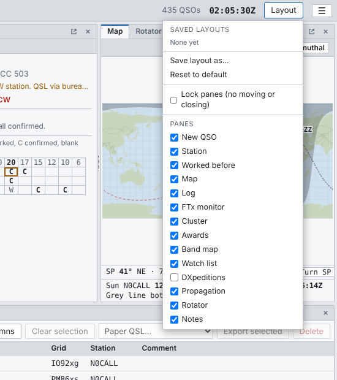 | 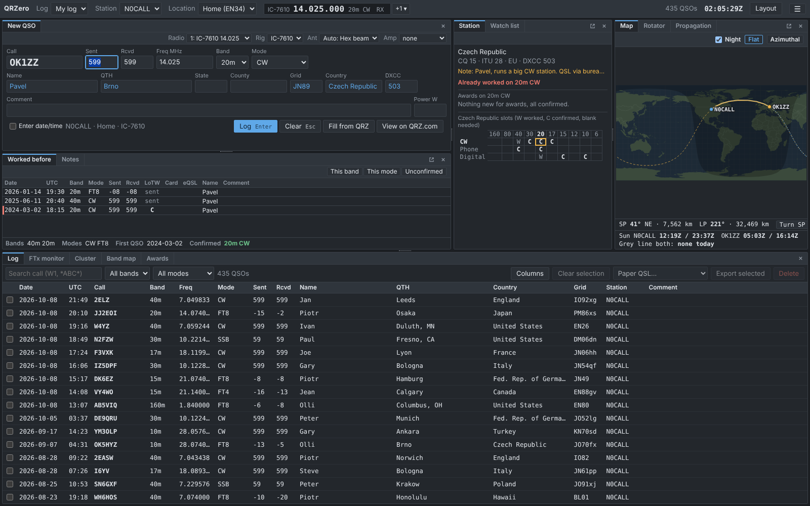 |

Colours can follow Windows or be always light or dark, and text size runs from 11 to 18 px.

## Settings, keyboard shortcuts and backups

**Settings** (☰ menu) opens on **General** and groups its sections down the left: Program (General, Backups, Keyboard), Station (Callsigns, Locations, Equipment, Logs), Logging (Entry fields, Callsign lookup, Awards) and Connections (Radios and programs, UDP connections, DX cluster, Startup programs).

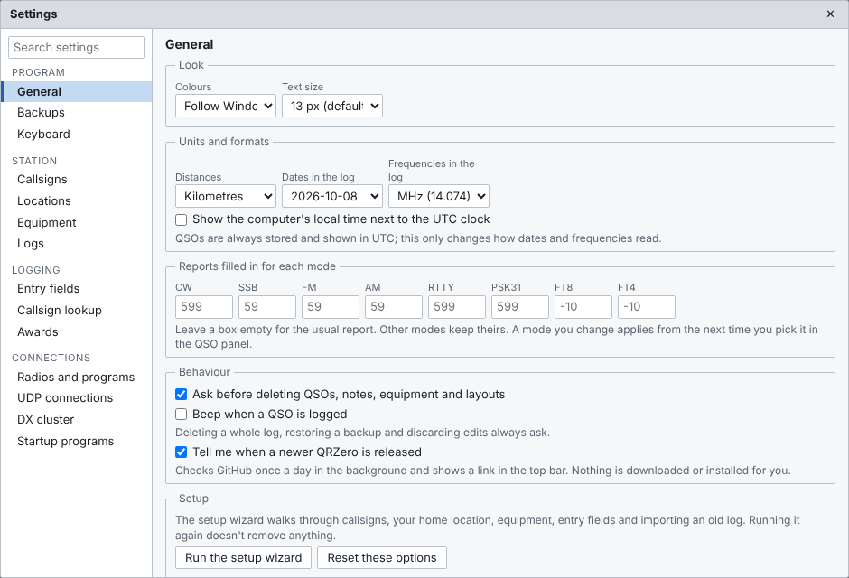

- **Search settings.** Type in the box at the top left (*rotor*, *backup*, *colours*, *alert*, *QRZ*) and the list shows each matching setting with the section it lives in; click one and Settings jumps there and outlines it.

  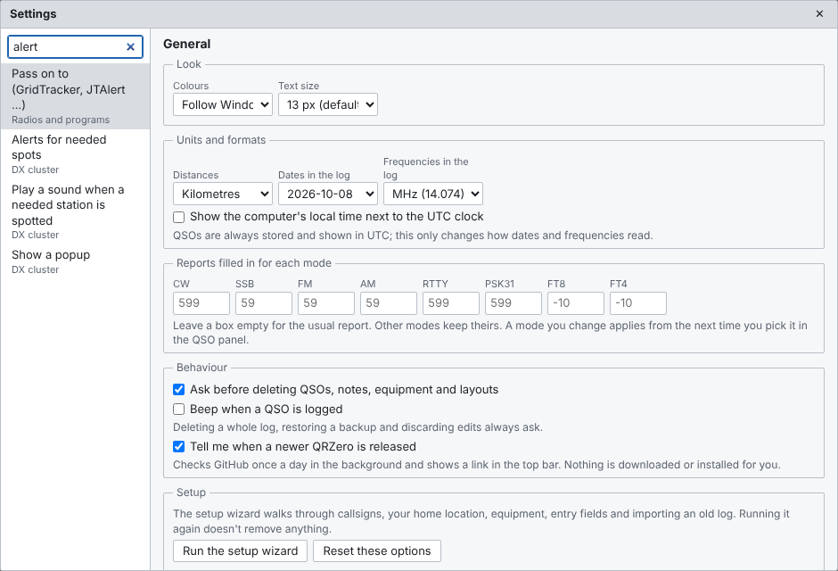
- **General** has colours, text size, kilometres or miles, date and frequency formats, local time next to UTC, the report each mode starts with, whether deletes ask first, a beep when a QSO is logged, and whether QRZero tells you when a newer release is out.
- **Keyboard.** Every key QRZero responds to is listed and can be changed: click the key button and press the new combination. A key already used is refused (and the message says by what), a bare letter or digit is refused because it would fire while you type a callsign, and **Print the list…** makes a one-page sheet of every key to keep by the radio. Your choices are stored in the log database and come back with a restored backup.

  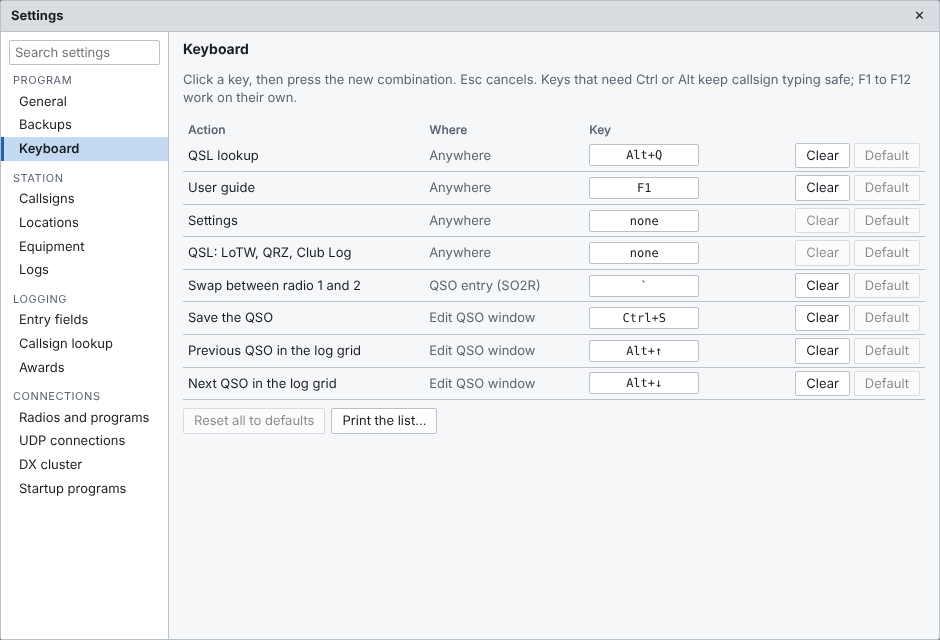
- **Backups.** QRZero backs up the log file once a day when it starts, keeps the newest ten automatic copies, makes a manual one on demand, and restores from any listed backup or file after checking it first. A *before restore* copy is saved so a wrong restore can be undone. Copy the backups folder to another drive now and then.
- **Country file.** DXCC entities come from AD1C's `cty.csv`, downloaded on first start and every two weeks; it can also be loaded from a file if your PC cannot reach the site.

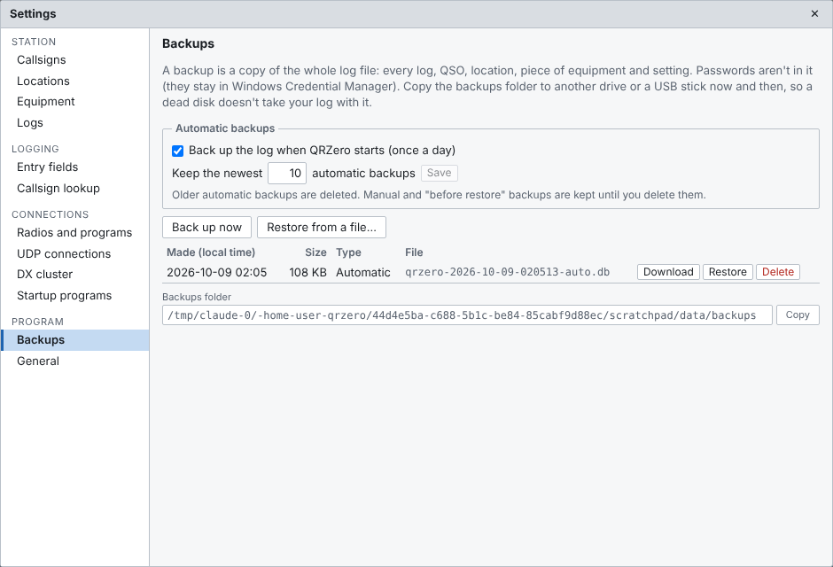

## Using a browser

The desktop app is a window onto a small local web server. You can run the server on its own and use any browser:

```sh
qrzero-server --data-dir "C:\path\to\data" --bind 127.0.0.1:8073
```

It prints a link that includes a session token; open it. The token keeps other programs on the computer from reading your log. The server only listens on this computer unless you tell it otherwise, so don't bind it to your network until network sign-in exists.

## Help

The full user guide is in [docs/user](docs/user/01-getting-started.md) and is built into the app under ☰ → **Help** (<kbd>F1</kbd>). It opens on a **Getting started** page that takes you from install to a first QSO, a connected radio, your logging programs and your QSLs, and a search box at the top finds any word on any page and jumps to it. Its chapters:

1. [Getting started](docs/user/01-getting-started.md)
2. [Logging QSOs](docs/user/02-logging.md)
3. [The log grid](docs/user/03-log-grid.md)
4. [Importing and exporting ADIF](docs/user/04-import-export.md)
5. [Callsigns, locations, logs and settings](docs/user/05-setup.md)
6. [Arranging the window](docs/user/06-layout.md)
7. [Radios, split and rotator](docs/user/07-radios.md)
8. [FTx monitor, WSJT-X and N1MM](docs/user/08-ftx-monitor.md)
9. [DX cluster](docs/user/09-cluster.md)
10. [QSL](docs/user/10-qsl.md)
11. [Awards](docs/user/11-awards.md)
12. [Using QRZero in a browser](docs/user/12-browser.md)
13. [Band map](docs/user/13-band-map.md)
14. [Watch list](docs/user/14-watch-list.md)
15. [Propagation](docs/user/15-propagation.md)
16. [UDP connections and startup programs](docs/user/16-udp-and-startup.md)
17. [DXpeditions](docs/user/17-dxpeditions.md)
18. [Contests](docs/user/18-contests.md)

| | |
| --- | --- |
| 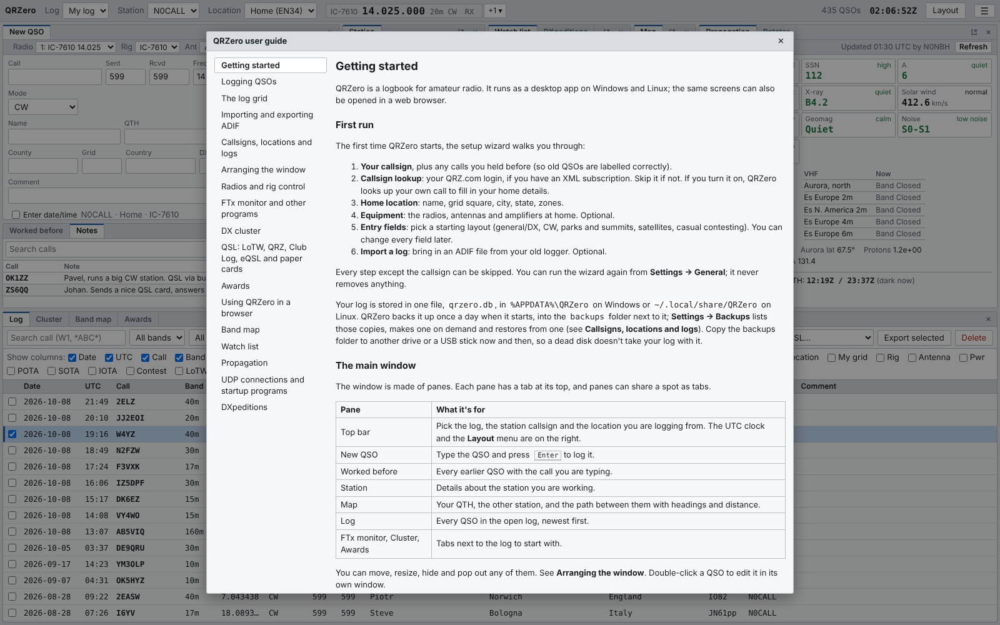 | 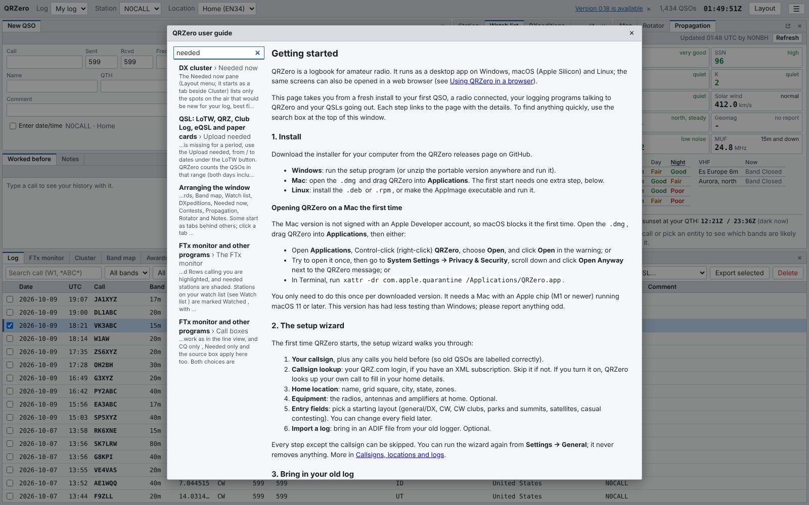 |

## Building from source

QRZero is a Rust workspace plus a React/TypeScript UI. You need Rust (stable) and Node 22.

| Path | What |
| --- | --- |
| `crates/core` | Log database (SQLite), ADIF reader/writer, QRZ client, awards, country file. No UI or HTTP. |
| `crates/radio` | Rig control (Hamlib, TCI, serial CAT, CI-V), rotators, WSJT-X, JTDX and N1MM UDP, DX cluster client. |
| `crates/server` | Local HTTP API (axum) with the UI embedded; the `qrzero-server` binary. |
| `src-tauri` | Desktop app: starts the server and opens a window on it. |
| `ui` | React + TypeScript UI (Vite). |
| `docs/user` | The user guide, shown in the app's Help. |
| `docs/screenshots` | The pictures in this file. |

```sh
cd ui && npm ci && npm run build && cd ..   # UI first: the server embeds ui/dist
cargo test                                   # core, radio and server tests
cargo run -p qrzero-server                   # browser version on http://127.0.0.1:8073
npx @tauri-apps/cli@2 build                  # Windows installer (MSI and setup .exe)
```

On a Mac (Apple Silicon) no extra libraries are needed beyond Xcode's command line tools:

```sh
npx @tauri-apps/cli@2 build --bundles dmg
```

On Linux install the build libraries first, then build the packages:

```sh
sudo apt install libwebkit2gtk-4.1-dev libayatana-appindicator3-dev librsvg2-dev libdbus-1-dev
npx @tauri-apps/cli@2 build --bundles deb,rpm,appimage
```

For UI work with live reload, run `cargo run -p qrzero-server -- --token dev`, then `npm run dev` in `ui/` and open `http://localhost:5173/?token=dev`.

Other checks:

```sh
cargo clippy --all-targets -- -D warnings
cargo test --release -p qrzero-core --test perf -- --ignored --nocapture   # 200k-QSO speed check
cd ui && npm run e2e                                                       # browser end-to-end test
```

The UI talks to the server only over `/api` with an `x-qrzero-token` header, so the same UI runs in the desktop window and in a browser. CI runs the tests on Linux, Windows and macOS (Apple Silicon), the speed and browser checks on Linux, and attaches the Windows installer and the Mac `.dmg` to each run.

### Releases

Pushing a tag builds the Windows, macOS and Linux packages and attaches them to that tag's GitHub Release (creating a pre-release if none exists). For a tag that already exists, run **Actions → Release → Run workflow** and enter the tag name. The version comes from the tag: `QRZero-Alpha-v0.12` builds version 0.12.0, and every file name carries it (use plain numbers, up to three parts; a tag with no number builds 0.1.0). Each release gets the MSI, the setup `.exe` and `QRZero_<version>_portable.exe`, a macOS `QRZero_<version>_aarch64.dmg` (unsigned), plus for Linux a `.deb`, an `.rpm`, an `.AppImage` and `QRZero-server_<version>_linux-x86_64.tar.gz`.

## Status

QRZero is in active development and its versions are alpha releases. Most integrations are built from the protocol documentation and checked against stand-ins in the test suite. The Mac build has only been built and tested in CI so far, not on a real Mac. Real-station testing so far covers WSJT-X, N1MM Logger+, AetherSDR over TCI and a WRC rotator controller over GS-232; the rest (Hamlib, serial CAT, CI-V, the other online services, QL-700 label printing, the contest calendar and the NAQCC and FISTS award rules) is less proven, so reports and bug reports are welcome. Keep your own ADIF export and the automatic backups until you trust it.

## License

MIT, as set in `Cargo.toml`.
